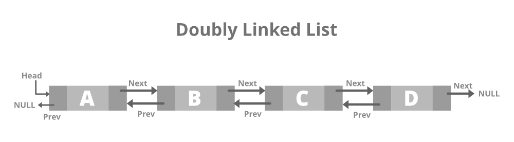

## Segurança relacionada a Blockchain

  

<ul style="margin-left: -0.5in">
    <li>Disciplina: Engenharia de Software
    <li>Professora: Flavia Garcia
    <li>Aluno: Daniel Birenbaum Guerrieri de Castro
<ul>

---

# **Introdução**

---

### | Conceito de lista ligada

- Estrutura de dados que armazena valores em sequência de nós
- Cada nó somente conhece seu sucessor (ou antecessor caso seja duplamente ligada)
- Um nó guarda o valor desejado e também referência para outro nó (endereço de memória)

---

# **A blockchain (Corrente de blocos)**

---

### | Blockchain e sua semelhança com a lista ligada

- Assim como o array e a lista ligada, blockchain é um estrutura de dados
- É um sistema usado para evitar fraudes em transações com criptomoedas
- Modificar um bloco invalida toda a corrente de blocos posteriores
- Armazena em um bloco: dado, hash, hash do bloco anterior.

---

### | O que é a hash?

- A Hash é um identificador do conteúdo de um bloco
- Modificar o conteúdo do bloco, modifica a hash
- Ou seja, como se fosse um "id" único do bloco
- Pode se pensar também como se fosse um ponteiro: A hash do bloco aponta para o bloco posterior que contém qual é a hash anterior

---

### | Como funciona de fato a blockchain

---

### | Tentativa de modificar o dado de um bloco

---

### | E se tentasse recalcular a hash de todos os blocos?

- Para fraudar/modificar o conteúdo do bloco, teria que modificar todas as hashes dos blocos posteriores
- Para evitar e tornar isso algo computacionalmente díficil, existe o conceito de "Proof of Work"

---

### | Proof of work

- É uma restrição inventada que torna o cálculo da hash mais díficil
- Essa restrição dita que qualquer has deva começar com uma quantidade _x_ de zeros. Com isso, não há solução melhor do que tentativa e erro para encontrar esse valor.
- Dessa forma, é computacionalmente impossível de se fraudar uma corrente inteira de blocos

---

# Com isso, a blockchain é <f style="color: red">_matematicamente_</f> segura, e não há a necessidade de nenhum governo ou instituição regular essa estrutura.

---

# **Implementação da Blockchain**

---

# Fontes e referências

- [Lista encadeada - Professor Nelio Alves ](https://www.youtube.com/live/wRXdDK3zGZs?si=Vh0e4pmltt6sNVms)

- [Artigo sobre blockchain e C#](https://towardsdatascience.com/blockchain-explained-using-c-implementation-fb60f29b9f07)
- [Imagem da lista ligada](https://www.geeksforgeeks.org/types-of-linked-list/)
